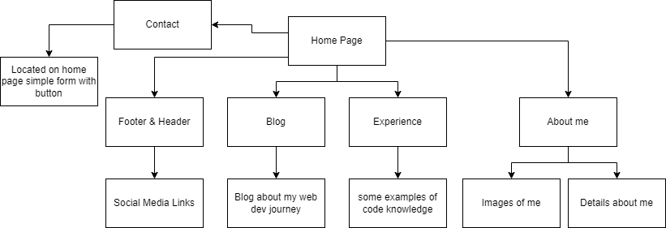
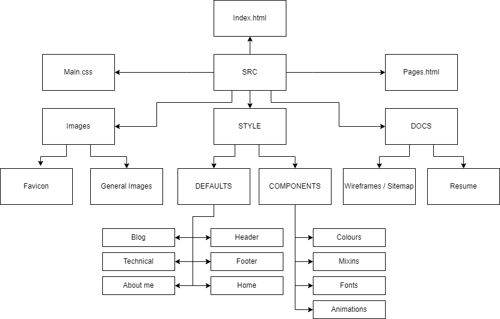
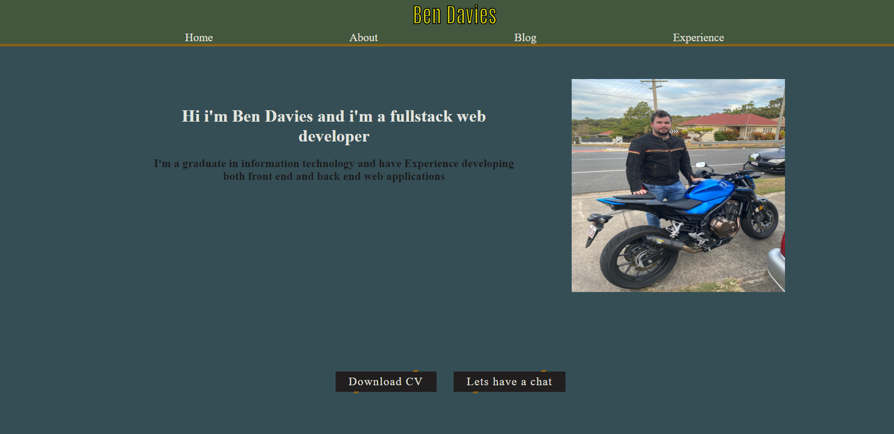

[My Portfolio Website](https://bendaviescoder.netlify.app/)

[My Portfolio Github Repository](https://github.com/BenDavies1218/Portfolio_T1A2)

[My Video Presentation]()

## Purpose  
- My Portfolio website is a demonstation of my skills with HTML and CSS, it demonstates how I can write efficient and clean code to engage a prospectful employer or client. 

## Functionality / features  
1. The website is a fully responsive design and will change the layout of the scale of components depending on the screen width.

2. The website includes various transitions, animations, Psuedo classes and Psuedo elements that makes it interactive and engages the viewer.

3. The main Feature of the home page is the Download Button and Lets have a chat button, these button are both styled the same. Kevin Powell does a great tutorial on [::Before and ::After Psuedo elements](https://www.youtube.com/watch?v=zGiirUiWslI) and thats how I achieved this design. 

4. One other Feature of the website is the back to top link located at the bottom of the home page and also on the about page. This anhcor when hovered on displays an animation of an arrow moving along the y-axis.

5. The experience page displays my preformated code and gives a Graphical representation of my expertises and knowledge of Markup Lanuages and programming. 

## Sitemap

## Screenshots
Home Page

Contact Form and Footer

About me Page

Technical Page

Blog Page

## Target audience
- This website is targeted at a Prospectful employer or Client. 

## Tech stack (e.g. html, css, deployment platform, etc
### This Website utilizes:
- HTML
  - Semantic Elements
- SCSS
  - Mixins
  - Variables
  - Imports
- CSS
  - Transitions
  - Animations
  - Flexbox
  - Media Queries
- It is Stored on github
- It has been deployed by Netlify 